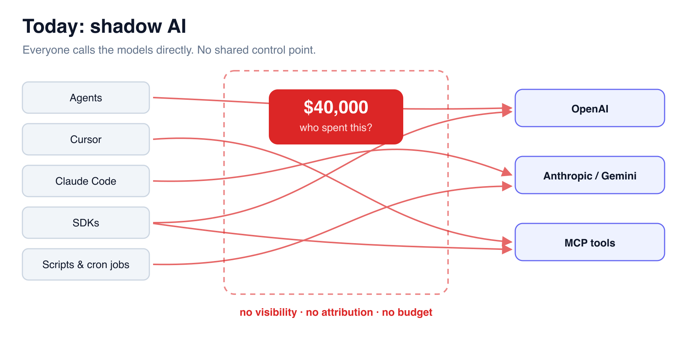
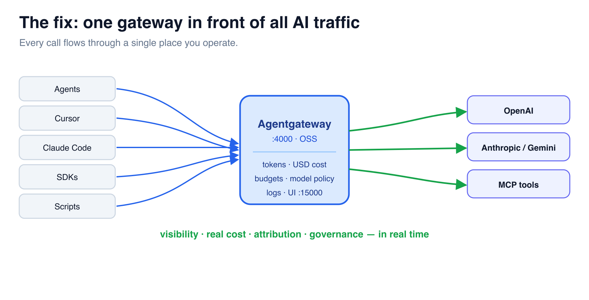

# The Blind Spot — and the Plan

It's Monday. Finance forwards a **$40,000 OpenAI invoice** and asks the only question
that matters: *who spent this?* Across the company, agents, copilots (Cursor, Claude
Code), SDKs, and one-off scripts all call LLMs and MCP tools **directly**. There's no
shared control point — no way to see cost, attribute spend, or stop a runaway job. This
is **shadow AI**: the same loss of control enterprises hit with microservices before
API gateways brought order.

## What you're actually paying for

LLMs bill per **token**, not per request — **input** (your prompt, history, documents,
tool schemas) + **output** (what the model generates). Price is per **1M tokens** and
varies **~17–20×** between models. What quietly inflates the bill: long context,
reasoning tokens, streaming, bulk embeddings, and **tool / MCP calls** (every tool
schema and result rides along as tokens). The provider dashboard is per-account,
delayed, and can't tell you which **team, agent, or human** made the call.

## The fix: one gateway in front of all AI traffic

Route every call through **Agentgateway** — a single control point you operate. You get
token usage, **real USD cost**, attribution, and governance across every model and
provider, in real time.

## What you'll build in this workshop

1. **Stand up the gateway** in Docker — your one control point.
2. **Add an LLM** — turn it into an LLM-native proxy and watch calls in the Logs.
3. **The cost of every request** — see the real USD cost the gateway puts on each call.
4. **Govern the spend** — enforce a token budget; over-budget requests get a `429`.
5. **Cost-aware routing** — cheap model by default, premium only when a request opts in.
6. **Add the everything MCP server** — bring tool traffic under the same gateway.
7. **Analyze the traffic** — query a week of spend: who, which model, how much.
8. **Per-team virtual keys** — authenticate and attribute every call; the real provider key never leaves the gateway.

By the end you'll be able to answer "who spent the money?" — and stop the runaway
before the invoice.

> ✅ Nothing to run here — click **Check** to begin. ➡️
