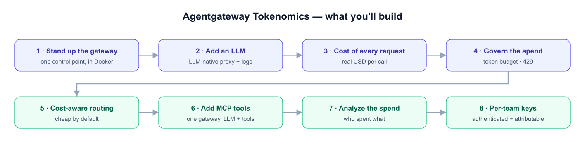
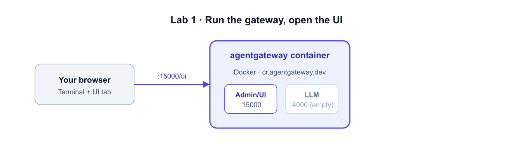

# Stand Up the Gateway

## What is Agentgateway?

**Agentgateway** is an open-source, purpose-built proxy (data plane) for **AI traffic**.
Today your apps, agents, copilots, and scripts call LLM providers and MCP tool servers
*directly* — so there's no single place to see cost, attribute spend, apply policy, or
secure access. Agentgateway becomes that single **control point**:

- **LLM-native proxy** — one OpenAI-compatible endpoint that fronts OpenAI, Anthropic, Gemini, Bedrock, and more.
- **MCP gateway** — proxies MCP tool servers so agent *tool* traffic is governed too.
- **Cost & observability** — prices and logs every call (real USD + tokens) out of the box.
- **Governance & security** — token budgets, rate limits, model routing, and per-team API keys.

It's a single binary (you'll run it as a **Docker container** here), and it ships with a
built-in **web UI** for setup and observability. This whole workshop is about turning it
into your AI control point, one capability at a time.



## What we're doing in this lab

Just get the gateway **running** and connect to it — the foundation for everything else.
A minimal **`/root/agentgateway/config.yaml`** is already staged (admin UI + a default
cost catalog + a request database, **no models yet**). Three ports matter: **:4000** (LLM
API), **:3000** (MCP), and **:15000** (admin + UI).



## Step 1 — Start the gateway

Start Agentgateway with the staged config. It exposes three ports — **:4000** (LLM),
**:3000** (MCP), and **:15000** (admin + UI) — and reads your config from `/config`.

```bash
docker run -d --name agentgateway --network agw --user 0:0 \
  -v /root/agentgateway:/config \
  -p 4000:4000 -p 3000:3000 -p 15000:15000 \
  -e ADMIN_ADDR=0.0.0.0:15000 \
  -e OPENAI_API_KEY \
  cr.agentgateway.dev/agentgateway:v1.3.1 -f /config/config.yaml

sleep 5
docker ps --filter name=agentgateway
```

**What you'll see:** the container `agentgateway` with status `Up`.

## Step 2 — Connect to the admin API

```bash
curl -s -o /dev/null -w "admin HTTP %{http_code}\n" http://localhost:15000/config_dump
```

`200` means the gateway is alive and reporting its config.

## Step 3 — Open the UI

Open the **Agentgateway UI** tab (it points at `:15000/ui`). You'll see **Welcome to
Agentgateway**. There are no models yet — you'll add one next.

> Everything in this lab runs on the gateway VM, so the **Terminal** reaches the
> gateway directly at `localhost`. The **UI tab** reaches `:15000` for visual setup
> and observability.

> Next: add an OpenAI model and send your first call *through* the gateway. ➡️
