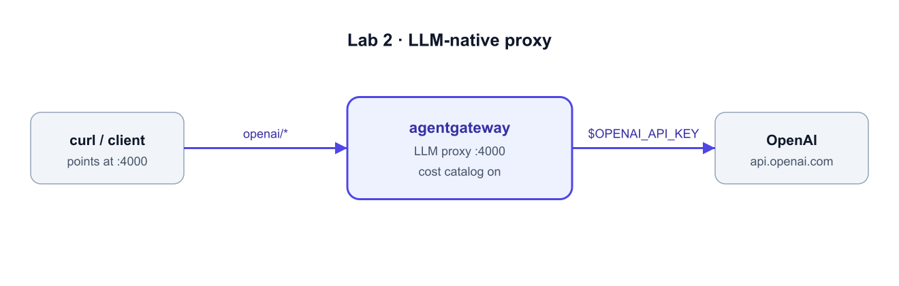

# Add an LLM



**What we're building:** an `llm.models` entry so clients call `openai/...` through
`:4000` and the gateway forwards to OpenAI using a key they never see. OpenAI is just
the example here — add `anthropic/*`, `gemini/*`, `bedrock/*`, etc. the same way, and
every provider rides the same gateway, logs, and cost tracking.

## Step 1 — Add an OpenAI model

**Option A — the UI:** open the **Agentgateway UI** → **Models** → **Add model**.
Incoming match `openai/*`, provider **OpenAI**, API key **Env var** `OPENAI_API_KEY`,
**Save**.

**Option B — YAML (Editor):** open `/root/agentgateway/config.yaml` and replace the
empty `models: []` with:

```yaml
  models:
  - name: "openai/*"
    provider: openAI
    params:
      model: gpt-4.1-nano
      apiKey: "$OPENAI_API_KEY"
```

Validate the config, then restart the gateway so it re-reads the file. (The
`--validate-only` run parses your config and exits; pass the key so the
`$OPENAI_API_KEY` reference resolves.)

```bash
docker run --rm -v /root/agentgateway:/config -e OPENAI_API_KEY \
  cr.agentgateway.dev/agentgateway:v1.3.1 -f /config/config.yaml --validate-only

docker restart agentgateway
```

`$OPENAI_API_KEY` is read from the container's environment — clients never see the
real key.

## Step 2 — Send your first call *through* the gateway

```bash
curl -s http://localhost:4000/v1/chat/completions \
  -H "Content-Type: application/json" \
  -d '{"model":"openai/gpt-4.1-nano","messages":[{"role":"user","content":"Say hello in one sentence."}],"max_tokens":20}' \
  | jq -r '.choices[0].message.content'
```

**What you'll see:** a normal OpenAI response — but it went through **your** gateway.
The bundled cost catalog already priced this call and logged it to the request
database (you'll mine that in Lab 4).

## Step 3 — See the call in the UI

Open the **Agentgateway UI** tab → left nav **Logs**. Your call shows up under
**Recent calls** (model, HTTP status, latency, tokens, and **realized cost**). Click
the row to expand **Request detail** — the model flow (what the client asked for vs
what the gateway sent vs what the provider returned), timing, and per-direction token
cost. That dollar figure came from the gateway, not a provider dashboard.

You'll also see a banner: **"Prompt logging is off."** By default the gateway records
metadata and cost, but **not** the prompt/response text. Let's turn that on.

## Step 4 — Capture payloads and attribute calls to a user/team

Click **Settings** (top-right of Logs) to open **Log settings**:

1. Toggle on **Include prompts and completions in logs** — this adds the
   `gen_ai.prompt` and `gen_ai.completion` attributes to each access log so you can
   inspect the actual request/response text.
2. **Request log identity** — these are optional **CEL expressions** that decide which
   **user** and **group** each call is attributed to in the logs (that's how the Logs
   view's **Users**/**Groups** filters and Lab 4's per-user cost breakdown get
   populated). Set, for example:

   | Field | CEL expression | Attributes from |
   |-------|----------------|-----------------|
   | **User attribute** | `default(request.headers["x-user-email"], "anonymous")` | an `x-user-email` request header |
   | **Group attribute** | `default(request.headers["x-team"], "default")` | an `x-team` request header |

   Other options, depending on how clients authenticate:
   - From a JWT (when JWT auth is on): user `default(jwt.email, jwt.sub)`, group `default(jwt.groups[0], "default")`
   - From the virtual API key used: user `apiKey.name` (each key can map to a user/team)
   - A static label for this gateway: user `"eng-team"`

   Click **Save settings**.

3. Send another call — this time identify who's making it:

   ```bash
   curl -s http://localhost:4000/v1/chat/completions \
     -H "Content-Type: application/json" \
     -H "x-user-email: alice@example.com" \
     -H "x-team: eng" \
     -d '{"model":"openai/gpt-4.1-nano","messages":[{"role":"user","content":"Summarize MCP in one line."}],"max_tokens":40}' \
     | jq -r '.choices[0].message.content'
   ```

Back in **Logs**, **Refresh**: the new call is attributed to `alice@example.com` /
`eng` (try the **Users** and **Groups** filters), and its **Request detail** now shows
the captured **prompt and completion**. That's the difference between "we spent
$40k" and "**alice on the eng team** spent it, on *these* prompts."

> 💡 **A note on the UI's Chat Playground.** You'll see a **Chat Playground** in the
> nav — it sends a test chat *from your browser*, building the URL as
> `https://<this-host>:4000`. That works when you run Agentgateway on your own machine,
> but **not in this hosted lab**: the lab serves each port on its own hostname (not
> `host:4000`), so the Playground's request can't reach `:4000` and it hangs at
> "Sending." That's a lab-environment quirk, not a gateway issue. **Use the Terminal**
> for live calls (it runs *on* the gateway VM, so it always works) and the **Logs**
> view to watch them — which is exactly what you just did.

> Next: bring **tool traffic** under the same gateway with a separate MCP server. ➡️
