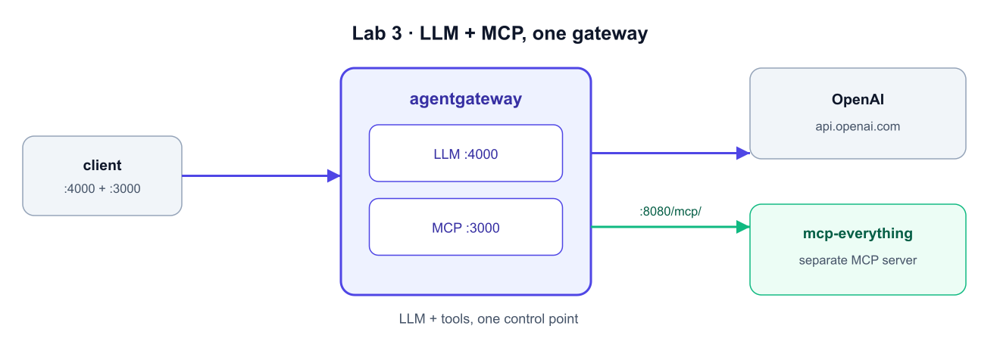

# Add the Everything MCP Server



**What we're doing:** we don't build an MCP server — we run the reference
[`@modelcontextprotocol/server-everything`](https://github.com/modelcontextprotocol/servers)
as a **separate streamable-HTTP service** on the shared `agw` network, then point the
gateway at it so it's proxied on `:3000`. The gateway reaches it by name over HTTP.

## Step 1 — Run the everything MCP server (streamable HTTP)

```bash
docker run -d --name mcp-everything --network agw \
  -e PORT=8080 -p 8080:8080 \
  node:20-alpine \
  npx -y @modelcontextprotocol/server-everything streamableHttp

sleep 5
docker logs mcp-everything 2>&1 | tail -3
```

**What you'll see:** `MCP Streamable HTTP Server listening on port 8080`.

## Step 2 — Point the gateway at it

In the **Editor**, add a top-level `mcp:` block to `/root/agentgateway/config.yaml`
(a sibling of `llm:`). The host uses the container name on the `agw` network:

```yaml
mcp:
  port: 3000
  policies:
    cors:
      allowOrigins: ["*"]
      allowHeaders: ["*"]
      exposeHeaders: ["Mcp-Session-Id"]
  targets:
  - name: everything
    mcp:
      host: http://mcp-everything:8080/mcp/
```

Validate the config, then restart the gateway so it picks up the MCP target:

```bash
docker run --rm -v /root/agentgateway:/config -e OPENAI_API_KEY \
  cr.agentgateway.dev/agentgateway:v1.3.1 -f /config/config.yaml --validate-only

docker restart agentgateway
```

## Step 3 — List the tools (and see the token cost)

```bash
SID=$(curl -s -D - -o /dev/null -X POST http://localhost:3000 \
  -H 'Content-Type: application/json' -H 'Accept: application/json, text/event-stream' \
  -d '{"jsonrpc":"2.0","id":1,"method":"initialize","params":{"protocolVersion":"2024-11-05","capabilities":{},"clientInfo":{"name":"cli","version":"1"}}}' \
  | tr -d '\r' | awk -F': ' 'tolower($1)=="mcp-session-id"{print $2}')

curl -s -o /dev/null -X POST http://localhost:3000 \
  -H 'Content-Type: application/json' -H 'Accept: application/json, text/event-stream' \
  -H "mcp-session-id: $SID" \
  -d '{"jsonrpc":"2.0","method":"notifications/initialized"}'

curl -s -X POST http://localhost:3000 \
  -H 'Content-Type: application/json' -H 'Accept: application/json, text/event-stream' \
  -H "mcp-session-id: $SID" \
  -d '{"jsonrpc":"2.0","id":2,"method":"tools/list"}' \
  | grep '^data:' | sed 's/^data: //' \
  | jq '{tool_count: (.result.tools|length), tool_names: [.result.tools[].name]}'
```

**What you'll see:** a dozen-plus tools. Every tool name, description, and JSON schema
is sent to the model as **input tokens** on each turn — that's the hidden cost of
tool-heavy agents, now visible and governable at the gateway.

> Next: a week of traffic has already flowed through this gateway. Let's analyze the
> spend. ➡️
