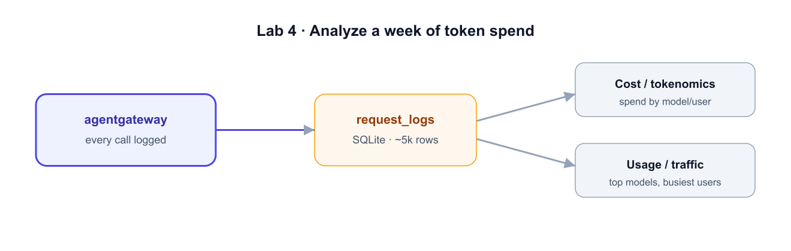

# Analyze the Traffic



**What we're analyzing:** the gateway logged every call to a SQLite request database
(`/root/agentgateway/data/data.db`) — about a week of traffic across multiple models,
providers, and users. The query the gateway answers from is the same table you'll
query directly.

The database (`request_logs`) has one row per request with `cost`, `total_tokens`,
`gen_ai_provider_name`, `gen_ai_request_model`, `agentgateway_user`, and
`agentgateway_group`.

## Cost / tokenomics

```bash
DB=/root/agentgateway/data/data.db

# Total spend, tokens, requests
sqlite3 -header -column "$DB" \
 "SELECT printf('\$%.2f', SUM(cost)) total_spend, SUM(total_tokens) tokens, COUNT(*) requests FROM request_logs;"

# Spend by provider
sqlite3 -header -column "$DB" \
 "SELECT gen_ai_provider_name provider, printf('\$%.2f', SUM(cost)) spend, COUNT(*) calls
  FROM request_logs GROUP BY 1 ORDER BY SUM(cost) DESC;"

# Top-spend models
sqlite3 -header -column "$DB" \
 "SELECT gen_ai_request_model model, printf('\$%.2f', SUM(cost)) spend
  FROM request_logs GROUP BY 1 ORDER BY SUM(cost) DESC LIMIT 5;"
```

**What you'll see** (your numbers will be similar): a few hundred dollars of total
spend, OpenAI as the largest provider, and `gpt-4.1` / `claude-sonnet-4-5` near the
top of per-model spend.

## Usage / traffic

```bash
DB=/root/agentgateway/data/data.db

# Busiest users (and what they cost)
sqlite3 -header -column "$DB" \
 "SELECT agentgateway_user user, COUNT(*) calls, printf('\$%.2f', SUM(cost)) spend
  FROM request_logs GROUP BY 1 ORDER BY calls DESC LIMIT 5;"

# Spend by team/group
sqlite3 -header -column "$DB" \
 "SELECT agentgateway_group team, printf('\$%.2f', SUM(cost)) spend
  FROM request_logs GROUP BY 1 ORDER BY SUM(cost) DESC;"
```

**What you'll see:** a single user (e.g. `alice@example.com`) driving a large share of
spend, and one team dominating the bill — exactly the attribution a direct-to-OpenAI
setup can't give you.

## See it in the UI

Open the **Agentgateway UI** tab and browse the request/usage pages for the same data
visually — the gateway turns invisible AI spend into queryable, attributable data.

> 🎉 You ran Agentgateway in Docker, proxied LLM + MCP traffic through one control
> point, and turned a week of token spend into answers. That's the foundation for
> governance: budgets, rate limits, and cost-aware routing.
