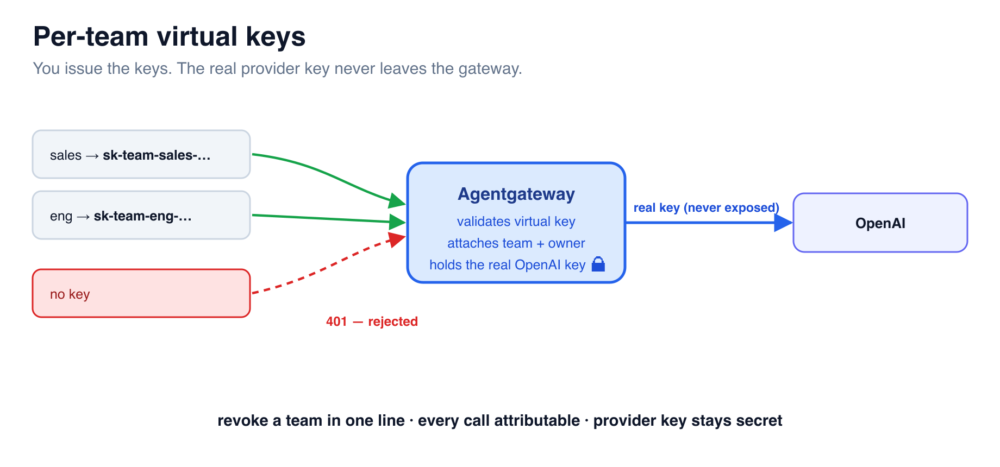

# Per-Team Virtual Keys



A **virtual key** is a credential *you* mint and hand to a team. Clients send the
virtual key; the gateway checks it, then uses its own provider key to call OpenAI.
Teams never see the real key, you can revoke a team by deleting one line, and the
key's `metadata` (team, owner) rides along for attribution.

## Step 1 — Add a virtual-key gate

In the **Editor**, add an `apiKey` policy under `llm.policies` (alongside `cors`), with
one key per team:

```yaml
  policies:
    cors:
      allowOrigins: ["*"]
      allowHeaders: ["*"]
      allowMethods: ["GET","POST","OPTIONS"]
    apiKey:                    # <-- add this
      mode: strict             # reject any request without a valid virtual key
      keys:
      - key: "sk-team-sales-DEMO"
        metadata: { team: sales, owner: "alice@example.com" }
      - key: "sk-team-eng-DEMO"
        metadata: { team: eng, owner: "bob@example.com" }
```

```bash
docker run --rm -v /root/agentgateway:/config -e OPENAI_API_KEY \
  cr.agentgateway.dev/agentgateway:v1.3.1 -f /config/config.yaml --validate-only
docker restart agentgateway
```

The gate is on the **`llm`** frontend (`:4000`); MCP keeps its own `:3000` port.

## Step 2 — No key, no service

```bash
curl -s -o /dev/null -w "%{http_code}\n" http://localhost:4000/v1/chat/completions \
  -H 'Content-Type: application/json' \
  -d '{"model":"openai/gpt-4.1-nano","messages":[{"role":"user","content":"hi"}],"max_tokens":5}'
```

Returns **401** — `mode: strict` rejects unkeyed traffic. Shadow AI can't even connect.

## Step 3 — A team's virtual key works

```bash
curl -s http://localhost:4000/v1/chat/completions \
  -H 'Authorization: Bearer sk-team-sales-DEMO' \
  -H 'Content-Type: application/json' \
  -d '{"model":"openai/gpt-4.1-nano","messages":[{"role":"user","content":"hi"}],"max_tokens":10}' | jq -r .model
```

Returns a normal response — and the gateway used the **real** OpenAI key, which the
sales team never saw. In the **Agentgateway UI** → **Virtual API Keys** you can see
the keys, and **Logs** now attributes calls to the team/owner from the key's metadata.

## Step 4 — Revoke in one line

Delete a team's key from the `keys:` list and `docker restart agentgateway` — that team
is cut off instantly, with zero impact on anyone else and no provider-key rotation.

> 🎉 **That's tokenomics under control.** You stood up Agentgateway, made it an
> LLM-native proxy, **priced** every call, **governed** spend with a token budget,
> **routed** cost-aware by header, brought **MCP** tools under the same control point,
> **analyzed** a week of spend, and locked the door with **per-team virtual keys** —
> the real provider key never leaving the gateway.
