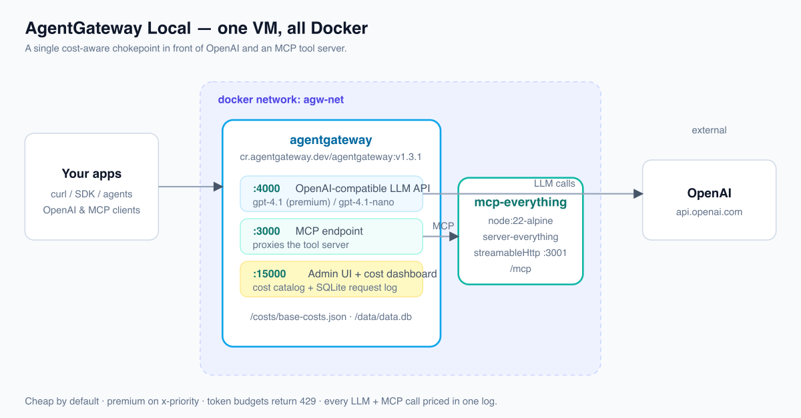

# AgentGateway Local — AI Cost Control Plane in Docker (Instruqt track)

A hands-on webinar that stands up **Agentgateway OSS entirely in Docker** on one VM —
no Kubernetes — and makes every dollar of LLM **and** MCP spend visible and governable.
It's the Docker-local sibling of `01-ai-cost-webinar-workshop` (which runs the binary).

**~60 min · 7 labs · real OpenAI traffic + an MCP server you build in Python.**

## Labs

| # | Lab | What you do |
|---|-----|-------------|
| 1 | **Start the Gateway in Docker** | `docker run` the gateway with a skeleton config; UI on `:15000` is up. |
| 2 | **Add OpenAI & Explore the UI** | Edit `config.yaml` to add OpenAI via the `$OPENAI_API_KEY` env var; reload; explore Models / Requests / Costs. |
| 3 | **Build an MCP Server** | Write a Python (FastMCP) MCP server, run it as a container, and proxy it through the gateway on `:3000`. |
| 4 | **Dive Into Code** | A Python client app: the OpenAI SDK pointed at `:4000` **and** an MCP client calling your tool on `:3000`. |
| 5 | **Govern the Spend** | Add a `localRateLimit` token budget (→ `429`). |
| 6 | **Cost-Aware Routing** | Header routing: `x-priority: high` → `gpt-4.1`, default → `gpt-4.1-nano` (~20× cheaper). |
| 7 | **Answer the CFO** | MCP tool schemas are tokens too; total the whole bill by model in one query. |

Each lab is **self-contained and resumable**: its `setup-server` seeds `/root/config.yaml`
(and `server.py` / `app.py` where relevant) to the previous lab's solved end-state, and
`solve-server` writes this lab's end-state.

## Architecture

Everything runs on a single Instruqt VM with Docker, on a user-defined bridge network
`agw-net` so containers resolve each other by name.

| Container | Image | Role |
|-----------|-------|------|
| `agentgateway` | `cr.agentgateway.dev/agentgateway:v1.3.1` | the gateway — LLM `:4000`, MCP `:3000`, admin UI `:15000` |
| `mcp-custom` | `mcp-python:local` (Python 3.12 + `mcp` SDK, pre-built at setup) running the learner's `server.py` | the MCP tool server built in Lab 3 (internal `:8000`, path `/mcp`) |

The gateway reaches the MCP server over `agw-net` at `http://mcp-custom:8000/mcp`
(an HTTP target — the gateway image has no Python/Node, so the MCP server is its own
container rather than a stdio process inside the gateway).

**Mounts into the gateway container:** `/root/config.yaml` → `/config.yaml`,
`/root/costs` → `/costs` (cost catalog), `/root/data` → `/data` (SQLite request log).

## Ports

- `4000` — OpenAI-compatible LLM API (`llm.port`; clients point here).
- `3000` — MCP endpoint (`mcp.port`; `llm` and `mcp` must use unique ports).
- `15000` — admin API + UI (`/ui`), bound to `0.0.0.0` via `config.adminAddr` so the
  lab's **Agentgateway UI** tab can reach it.

## Helper commands (loaded in the terminal + used by lab scripts)

Defined in `/root/agw-helpers.sh` (sourced by `~/.bashrc` and by the check/solve scripts):

- `agw-validate` — `--validate-config` against `/root/config.yaml` (passes the OpenAI key in).
- `agw-up` / `agw-restart` — (re)create the gateway container from the config.
- `agw-reload` — `docker restart agentgateway` to pick up a config edit (config is mounted).
- `agw-logs` / `agw-down` — tail logs / stop the gateway.
- `mcp-up` — (re)create the `mcp-custom` container from `/root/mcp-server/server.py`.
- `mcp-logs` / `mcp-down` — tail logs / stop the MCP server.

## Layout

- `config.yml` — single VM, `OPENAI_API_KEY` secret.
- `track.yml` — track metadata (`id`/`checksum` assigned on push).
- `track_scripts/setup-server` — pulls images, creates `agw-net`, pre-builds
  `mcp-python:local`, installs `uv`, provisions `/root/costs/base-costs.json`, writes the
  `agw-*`/`mcp-*` helpers.
- `track_scripts/cleanup-server` — removes both containers and the network.
- `assets/costs/base-costs.json` — model cost catalog (USD per 1M tokens).
- `assets/diagram-architecture.{svg,png}` — the diagram above.
- `NN-*/` — per-lab `assignment.md`, `setup-server`, `check-server`, `solve-server`.
- `docs/superpowers/specs/` — the design spec.

## Cost story demonstrated

- **Per-request cost** from a cost catalog + SQLite log — no month-end surprise.
- **Token budgets** (`localRateLimit`, `type: tokens`) that fail fast with `429`.
- **Cost-aware routing** — cheap by default, premium only on opt-in header.
- **MCP traffic** under the same log and the same governance as LLM traffic.
