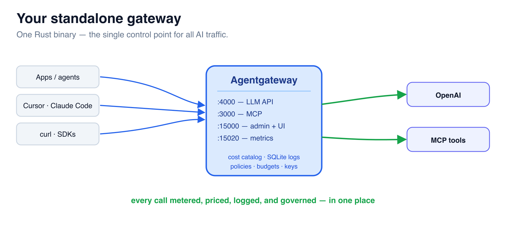

# Stand Up the Gateway



Agentgateway OSS is a single Rust binary — no Kubernetes, no sidecars. It comes
with a **web UI** for setup. You'll start it with a minimal config, then add your
OpenAI model in the UI — and it becomes an **OpenAI-compatible proxy** your apps
point at instead of `api.openai.com`.

A minimal **`/root/config.yaml`** is already staged (admin UI + a default cost
catalog + request database, no models yet). Two ports matter: **:4000** (the LLM
API) and **:15000** (admin + UI).

## Step 1 — Start the gateway

```bash
agentgateway -f /root/config.yaml --validate-only      # Configuration is valid!
nohup agentgateway -f /root/config.yaml > /root/agentgateway.log 2>&1 &
sleep 3
```

## Step 2 — Open the UI and add a model

Open the **Agentgateway UI** tab (`:15000/ui`). You'll see **Welcome to
Agentgateway** → you can **Enable LLM** (or **Skip setup**). Then:

1. Left nav → **Models** → **Add model**
2. **Incoming model match:** `openai/*`  (the default — matches any `openai/`-prefixed model)
3. **Provider:** OpenAI
4. **Provider API Key:** choose **Env var**, value `OPENAI_API_KEY`
5. **Save model**

Clients then call models as `openai/gpt-4.1-nano`, `openai/gpt-4.1`, etc.

That's it — the UI writes the model into your config. (Prefer YAML? The same
thing is just an `llm.models` entry — paste this into the Terminal instead:)

```bash
cat > /root/config.yaml <<'EOF'
config:
  adminAddr: "0.0.0.0:15000"
  database:
    url: "sqlite:///root/data/data.db"
  modelCatalog:
    - file: /root/costs/base-costs.json
llm:
  port: 4000
  policies:
    cors:
      allowOrigins: ["*"]
      allowHeaders: ["*"]
      allowMethods: ["GET","POST","OPTIONS"]
  models:
  - name: "openai/*"
    provider: openAI
    params:
      model: gpt-4.1-nano
      apiKey: "$OPENAI_API_KEY"
frontendPolicies:
  http:
    maxBufferSize: 33554432
EOF
agw-restart
```

The `$OPENAI_API_KEY` is read from the environment — clients never see the real
key. Note the gateway also loaded a default **cost catalog** (`base-costs.json`,
~846 models) and a **request database** — so cost tracking + logging are already
on, with zero extra setup.

## Step 3 — Send your first call *through the gateway*

```bash
curl -s http://localhost:4000/v1/chat/completions \
  -H "Content-Type: application/json" \
  -d '{"model":"openai/gpt-4.1-nano","messages":[{"role":"user","content":"Say hello in one sentence."}],"max_tokens":20}' | jq -r '.choices[0].message.content'
```

A normal OpenAI response — but it went through **your** gateway. You can also try
the UI's **Chat Playground** tab. Every client that points at `:4000` instead of
OpenAI directly is now under your control point.

> Next: see the **dollar figure** the gateway already put on that call. ➡️
