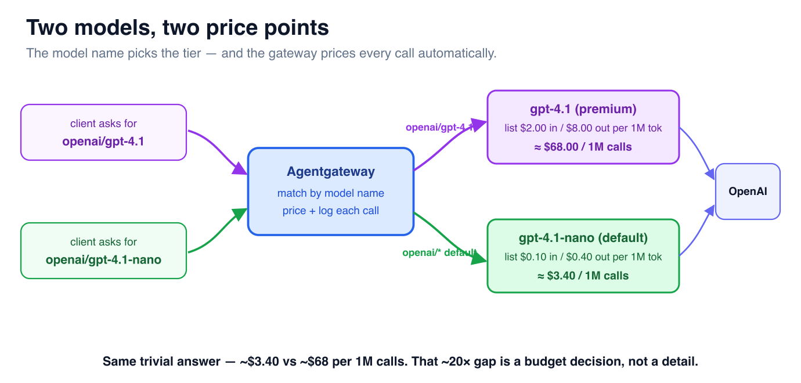

# The Cost of Every Request

Good news: you don't have to *configure* cost tracking — it's already on. Your
config loaded the default **`base-costs.json`** catalog (~846 models, USD per 1M
tokens) and a **request database**, so the gateway is already pricing and
recording every call. This challenge is about *seeing* it.

## Step 1 — Look at the price list

```bash
grep -A4 '"gpt-4.1-nano"\|"gpt-4.1"' /root/costs/base-costs.json | head
```

Rates are **USD per 1 million tokens**, split into input and output — exactly how
providers bill. Note `gpt-4.1` ($2.00 / $8.00) costs **~20×** `gpt-4.1-nano`
($0.10 / $0.40).

> **Where does this catalog come from?** It's seeded from public pricing data
> (models.dev) — ~846 models out of the box. Keep it current from the Admin UI
> (**Costs** page → refresh base costs) or regenerate the file with
> `agctl costs import --out /root/costs/base-costs.json`. Pricing changes often;
> a stale catalog means wrong cost numbers.

## Step 2 — Offer both a premium and a cheap model

To compare costs you need the gateway to actually *serve* both models. Add a
**premium** model matched by name (`openai/gpt-4.1` → real `gpt-4.1`) alongside the
**cheap** catch-all (`openai/*` → `gpt-4.1-nano`).



Paste this into the **Terminal**:

```bash
cat > /root/config.yaml <<'EOF'
config:
  adminAddr: "0.0.0.0:15000"
  database:
    url: "sqlite:///root/data/data.db"
  modelCatalog:
    - file: /root/costs/base-costs.json
llm:
  port: 4000
  policies:
    cors:
      allowOrigins: ["*"]
      allowHeaders: ["*"]
      allowMethods: ["GET","POST","OPTIONS"]
  models:
  - name: "openai/gpt-4.1"                # asked for by name → real gpt-4.1
    provider: openAI
    params: { model: gpt-4.1, apiKey: "$OPENAI_API_KEY" }
  - name: "openai/*"                       # everything else → cheap nano
    provider: openAI
    params: { model: gpt-4.1-nano, apiKey: "$OPENAI_API_KEY" }
frontendPolicies:
  http:
    maxBufferSize: 33554432
EOF
agentgateway -f /root/config.yaml --validate-only
agw-restart
```

The gateway picks the model by **matching the requested name**: `openai/gpt-4.1`
hits the specific entry; anything else falls through to the `openai/*` default.

## Step 3 — Drive a cheap call and a premium call

```bash
# cheap model
curl -s http://localhost:4000/v1/chat/completions -H "Content-Type: application/json" \
  -d '{"model":"openai/gpt-4.1-nano","messages":[{"role":"user","content":"Say hi in 3 words."}],"max_tokens":20}' | jq -r '.choices[0].message.content'

# premium model
curl -s http://localhost:4000/v1/chat/completions -H "Content-Type: application/json" \
  -d '{"model":"openai/gpt-4.1","messages":[{"role":"user","content":"Say hi in 3 words."}],"max_tokens":20}' | jq -r '.choices[0].message.content'
```

Each prints the model's short reply — the calls went through **your** gateway to
OpenAI and back, and were just priced and logged.

## Step 4 — See the cost, cleanly

Every call is priced and written to the database. Pull the last few as a tidy
table (no log-grepping):

```bash
sqlite3 -box /root/data/data.db \
  "SELECT gen_ai_request_model AS model, input_tokens AS in_tok, output_tokens AS out_tok,
          printf('\$%.7f', cost) AS cost_usd
   FROM request_logs ORDER BY completed_at DESC LIMIT 3;"
```

```
┌──────────────┬────────┬─────────┬────────────┐
│ model        │ in_tok │ out_tok │ cost_usd   │
├──────────────┼────────┼─────────┼────────────┤
│ gpt-4.1      │ 14     │ 5       │ $0.0000680 │
│ gpt-4.1-nano │ 14     │ 5       │ $0.0000034 │
└──────────────┴────────┴─────────┴────────────┘
```

**A clean dollar figure on every single call** — and the model column shows what
*actually ran* (the gateway logs the served model, not the name you typed). It's
in the access log too if you ever need it: `grep cost /root/agentgateway.log`.

## Step 5 — The teaching moment: same answer, 20× the price

Pick **one row per model** (so it doesn't matter which call you ran last):

```bash
sqlite3 -box /root/data/data.db \
  "SELECT gen_ai_request_model AS model, printf('\$%.6f', MAX(cost)) AS per_call,
          printf('\$%.2f', MAX(cost)*1000000) AS per_1M_calls
   FROM request_logs
   WHERE gen_ai_request_model IN ('gpt-4.1','gpt-4.1-nano')
   GROUP BY gen_ai_request_model ORDER BY MAX(cost) DESC;"
```

```
┌──────────────┬───────────┬──────────────┐
│ model        │ per_call  │ per_1M_calls │
├──────────────┼───────────┼──────────────┤
│ gpt-4.1      │ $0.000068 │ $68.00       │
│ gpt-4.1-nano │ $0.000003 │ $3.40        │
└──────────────┴───────────┴──────────────┘
```

Same trivial answer — **$3.40 vs $68.00 per million calls.** That ~20× gap is
exactly why "which model?" is a budget decision, not a detail.

## Step 6 — Correct the price with an override

List price isn't *your* price. Maybe you negotiated an enterprise discount, or you
add a markup for internal chargeback. Agentgateway lets you **layer catalogs** —
later files win — so you override only what you need without touching the base.

Write a tiny overrides file with your negotiated `gpt-4.1` rate (40% off), then
layer it on top of the base catalog:

```bash
cat > /root/costs/overrides.json <<'EOF'
{ "providers": { "openai": { "models": {
  "gpt-4.1": { "rates": { "input": "1.20", "output": "4.80" } } } } } }
EOF

# point modelCatalog at base first, then overrides (later wins)
sed -i 's#    - file: /root/costs/base-costs.json#    - file: /root/costs/base-costs.json\n    - file: /root/costs/overrides.json#' /root/config.yaml
agentgateway -f /root/config.yaml --validate-only
agw-restart
```

Re-run the **premium** call, then look at its cost again:

```bash
curl -s http://localhost:4000/v1/chat/completions -H "Content-Type: application/json" \
  -d '{"model":"openai/gpt-4.1","messages":[{"role":"user","content":"Say hi in 3 words."}],"max_tokens":20}' >/dev/null

sqlite3 -box /root/data/data.db \
  "SELECT gen_ai_request_model AS model, printf('\$%.2f', cost*1000000) AS per_1M_calls
   FROM request_logs WHERE gen_ai_request_model='gpt-4.1' ORDER BY completed_at DESC LIMIT 2;"
```

You'll get **two `gpt-4.1` rows, newest first** — and that's the point:

- **top** = the call you *just* made → **~$40.80** / 1M (your negotiated rate)
- **bottom** = an earlier call at list price → **~$68.00** / 1M

Same model, same prompt — the override cut the price ~40% with no base-catalog
edit. That's how you make the gateway's cost numbers match *your* contract.

## Step 7 — It's a metric too

```bash
curl -s http://localhost:15020/metrics | grep cost_catalog
```

`agentgateway_cost_catalog_lookups_total{status="Exact",...}` confirms the gateway
priced the request. Point Prometheus/Grafana at `:15020` and cost becomes a
dashboard.

## Step 8 — See it as a chart

Open the **Agentgateway UI** tab (`:15000/ui`) → left nav → **Costs**. The same
numbers you just queried are here as **charts** — spend broken down by model, no
SQL required. Fire another call from the **Terminal** (re-run a curl from Step 3)
and refresh the page to watch the spend tick up. This is the view you'd hand a
manager.

> Now you can answer *"how much did that call cost?"* Next: explore the whole
> gateway in its **web UI**. ➡️
