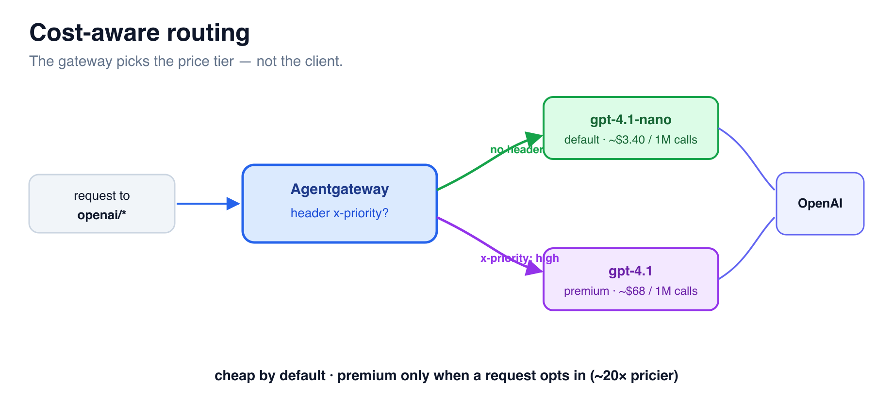

# Cost-Aware Routing



In the last challenge you pinned *everyone* to `gpt-4.1-nano`. But some requests
genuinely need a frontier model. Instead of trusting clients to choose (and pay)
responsibly, make the **gateway** decide: cheap by default, premium only when a
request carries an explicit `x-priority: high` header.

## Step 1 — Two models, two price points

Give the `llm` block **two models**: a premium one that only matches when the
request carries `x-priority: high`, and a catch-all default. Paste this:

```bash
cat > /root/config.yaml <<'EOF'
config:
  adminAddr: "0.0.0.0:15000"
  database:
    url: "sqlite:///root/data/data.db"
  modelCatalog:
    - file: /root/costs/base-costs.json
llm:
  port: 4000
  policies:
    cors:
      allowOrigins: ["*"]
      allowHeaders: ["*"]
      allowMethods: ["GET","POST","OPTIONS"]
    localRateLimit:
    - { maxTokens: 200000, tokensPerFill: 200000, fillInterval: "1h", type: tokens }
  models:
  - name: "openai/*"
    matches:
    - headers:
      - name: x-priority
        value: { exact: high }
    provider: openAI
    params: { model: gpt-4.1, apiKey: "$OPENAI_API_KEY" }
  - name: "openai/*"
    provider: openAI
    params: { model: gpt-4.1-nano, apiKey: "$OPENAI_API_KEY" }
frontendPolicies:
  http:
    maxBufferSize: 33554432
EOF
agentgateway -f /root/config.yaml --validate-only
agw-restart
```

Order matters: the **premium** model (more specific — it requires the header) is
listed first, so it's matched before the catch-all default.

## Step 2 — Prove it

The client asks for the **same** model both times (`openai/gpt-4.1-nano` — note the
`openai/` prefix, which is what the `openai/*` routes match on). Only the header
changes. First, default traffic → cheap model:

```bash
curl -s http://localhost:4000/v1/chat/completions -H 'Content-Type: application/json' \
  -d '{"model":"openai/gpt-4.1-nano","messages":[{"role":"user","content":"hi"}],"max_tokens":10}' | jq -r .model
```

Returns **`gpt-4.1-nano`**. Now escalate with the header:

```bash
curl -s http://localhost:4000/v1/chat/completions -H 'x-priority: high' -H 'Content-Type: application/json' \
  -d '{"model":"openai/gpt-4.1-nano","messages":[{"role":"user","content":"hi"}],"max_tokens":10}' | jq -r .model
```

Returns **`gpt-4.1`**. Same endpoint, same request body — the **gateway** decided
the price tier from the header, even overriding the model the client asked for.

## Step 3 — Why this saves real money

Most traffic is routine (summaries, classification, simple Q&A) and runs fine on
a small model at ~1/17th the cost. Reserve the frontier model for the few
requests that truly need it. Your apps set `x-priority: high` only on those — and
they physically *cannot* reach gpt-4.1 any other way.

> Next: tag and slice that spend so you can see exactly where it lands. ➡️
