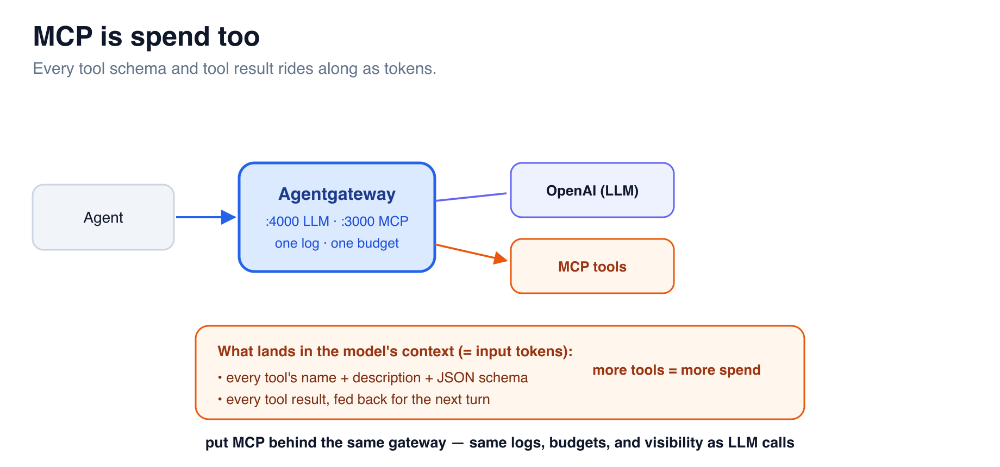

# MCP Is Spend Too



**MCP** (Model Context Protocol) is how agents discover and call tools. The cost
catch: every tool's JSON schema is sent to the model as **input tokens**, and
every tool **result** comes back as input tokens on the *next* call. Ten tools
with verbose schemas can add thousands of input tokens to every single turn —
spend that's completely invisible if MCP traffic doesn't go through your gateway.

Agentgateway proxies MCP servers too, so LLM **and** tool traffic share one
control point.

## Step 1 — Add an MCP server on its own port

LLM lives on `:4000`. Give MCP its **own port, `:3000`** — `llm` and `mcp` must
use unique ports. In the **Editor**, add a top-level `mcp:` block to
`/root/config.yaml` (a sibling of `llm:`):

```yaml
mcp:
  port: 3000
  targets:
  - name: everything
    stdio:
      cmd: npx
      args: ["-y","@modelcontextprotocol/server-everything"]
```

This proxies the reference `server-everything` MCP server (started on demand via
`npx`) and exposes it at **`:3000`** — alongside your LLM gateway on `:4000`.

```bash
agentgateway -f /root/config.yaml --validate-only
agw-restart
```

## Step 2 — Confirm MCP is live on :3000

```bash
curl -s -o /dev/null -w "%{http_code}\n" -X POST http://localhost:3000 \
  -H 'Content-Type: application/json' -H 'Accept: application/json, text/event-stream' \
  -d '{"jsonrpc":"2.0","id":1,"method":"initialize","params":{"protocolVersion":"2024-11-05","capabilities":{},"clientInfo":{"name":"c","version":"1"}}}'
```

`200` means the MCP server is proxied and answering.

## Step 3 — List the tools (and see the token cost)

Tools are discovered over that same MCP endpoint. From the **Terminal**, complete
the handshake and ask the server what tools it exposes — the metadata you get back
is exactly what gets injected into the model's context as **input tokens**:

```bash
# 1) initialize and capture the MCP session id
SID=$(curl -s -D - -o /dev/null -X POST http://localhost:3000 \
  -H 'Content-Type: application/json' -H 'Accept: application/json, text/event-stream' \
  -d '{"jsonrpc":"2.0","id":1,"method":"initialize","params":{"protocolVersion":"2024-11-05","capabilities":{},"clientInfo":{"name":"cli","version":"1"}}}' \
  | tr -d '\r' | awk -F': ' 'tolower($1)=="mcp-session-id"{print $2}')

# 2) signal initialized, then list the tools
curl -s -o /dev/null -X POST http://localhost:3000 \
  -H 'Content-Type: application/json' -H 'Accept: application/json, text/event-stream' \
  -H "mcp-session-id: $SID" \
  -d '{"jsonrpc":"2.0","method":"notifications/initialized"}'

curl -s -X POST http://localhost:3000 \
  -H 'Content-Type: application/json' -H 'Accept: application/json, text/event-stream' \
  -H "mcp-session-id: $SID" \
  -d '{"jsonrpc":"2.0","id":2,"method":"tools/list"}' \
  | grep '^data:' | sed 's/^data: //' \
  | jq '{tool_count: (.result.tools|length), tool_names: [.result.tools[].name]}'
```

`server-everything` exposes a dozen-plus tools. Every one of those names,
descriptions, and JSON schemas is sent to the model on **each** turn — that's the
hidden token cost of tool-heavy agents, now visible and governable at the gateway.

> Live MCP calls go through the **Terminal** for the same reason as LLM calls — the
> browser can't reach the gateway's `:3000` through the hosted lab. The UI's data
> pages stay useful for *observing* traffic.

## Step 4 — Why this matters for cost

- **Same logs** — MCP calls land in the same access log as LLM calls.
- **Same governance** — the same budget/policy machinery applies.
- **Same `config_dump`** — one place to see everything an agent can reach.

Without this, MCP tool traffic is yet another blind spot inflating your token
bill. With it, the tools your agents use are as visible and governable as the
models they call.

> You now control LLM and MCP traffic from one gateway. Next: issue **per-team
> virtual keys** so every call is authenticated and attributable. ➡️
