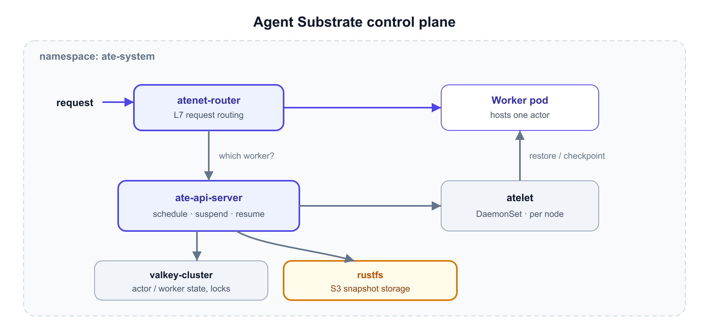

# Install Agent Substrate

You'll install Agent Substrate (v0.0.6) from its published Helm charts into the `ate-system`
namespace.

## How the pieces fit together

Everything below lands in `ate-system`. A request flows through the router to a worker;
the api-server decides *which* worker and drives suspend/resume:



## Step 1: Install the substrate CRDs

```bash,run
helm upgrade --install substrate-crds \
  oci://ghcr.io/kagent-dev/substrate/helm/substrate-crds \
  --version 0.0.6 \
  --namespace ate-system --create-namespace --wait
```

## Step 2: Install the substrate control plane

```bash,run
helm upgrade --install substrate \
  oci://ghcr.io/kagent-dev/substrate/helm/substrate \
  --version 0.0.6 \
  --namespace ate-system --wait --timeout 10m
```

This pulls several images and starts the valkey cluster, so it can take a few minutes.

## Step 3: Watch it come up

```bash,run
kubectl get pods -n ate-system
```

Wait until you see `ate-api-server`, `ate-controller`, `atelet-*`, `atenet-router`,
`valkey-cluster-0` through `-5`, and `rustfs` all `Running` (a few init Jobs will show
`Completed`).

## Step 4: Inspect the CRDs you just installed

```bash,run
kubectl get crd | grep ate.dev
kubectl get workerpools.ate.dev -A
```

There are no WorkerPools yet — kagent will create one in the next challenge.

## ✅ What you've learned

- Agent Substrate runs its control plane in `ate-system`.
- `ate-api-server` schedules actors onto workers; `atenet-router` routes requests; `atelet`
  drives the sandbox lifecycle; `valkey` stores state; `rustfs` stores snapshots.
- The `WorkerPool` and `ActorTemplate` CRDs are now available.
