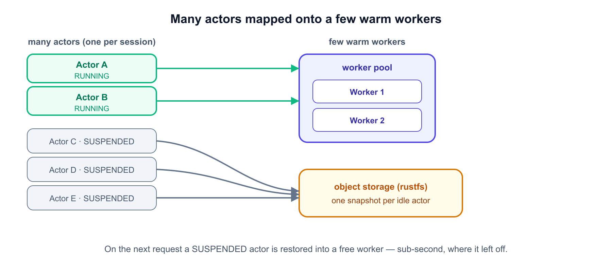
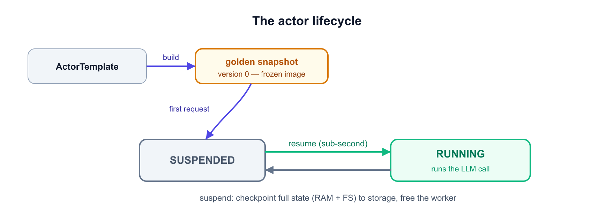
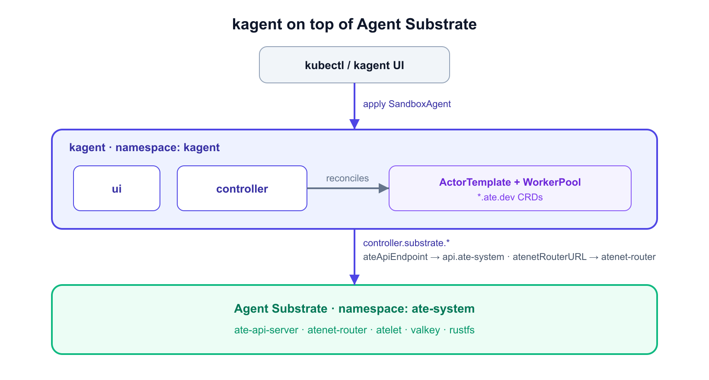
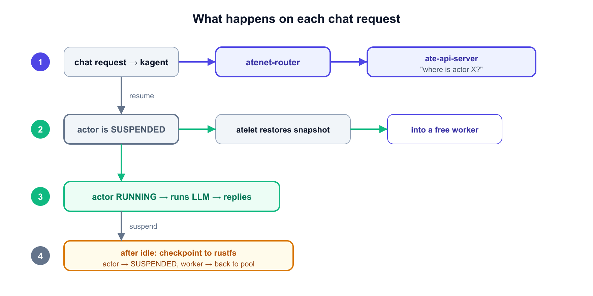

# Agent Substrate with kagent, end to end

This single lab takes you all the way through Agent Substrate: from the model, to
deploying substrate + kagent on a local `kind` cluster, to running a real `SandboxAgent`
inside a gVisor actor and watching it suspend and resume.

## Key terms

| Term | Meaning |
|------|---------|
| **Actor** | One logical agent session. State: `RUNNING` or `SUSPENDED`. |
| **Worker** | A pre-warmed pod hosting at most one actor. State: `IDLE` or `BUSY`. |
| **WorkerPool** | A set of warm standby worker pods (a CRD). |
| **ActorTemplate** | The immutable "class" an actor is created from (a CRD). Creating one builds a **golden snapshot** (version 0). |
| **Golden snapshot** | The initial frozen image every new actor is restored from. |
| **Suspend / Resume** | Checkpoint actor state to object storage / restore it sub-second. |

Many logical **actors** are mapped onto a *small* pool of warm **workers**. An idle
actor isn't a pod — it's a snapshot sitting in object storage:





---

## Part 1 — Confirm your cluster is ready

Your environment already created a `kind` cluster named `kagent-substrate`. Verify it:

```bash
kubectl get nodes
```

You should see one node in `Ready` state.

```bash
kubectl cluster-info
kind version
helm version --short
grpcurl --version
```

---

## Part 2 — Install Agent Substrate

Everything below lands in `ate-system`. A request flows through the router to a worker;
the api-server decides *which* worker and drives suspend/resume:


Install the substrate CRDs:

```bash
helm upgrade --install substrate-crds \
  oci://ghcr.io/kagent-dev/substrate/helm/substrate-crds \
  --version 0.0.6 \
  --namespace ate-system --create-namespace --wait
```

Install the substrate control plane (pulls several images and starts valkey, so it can
take a few minutes):

```bash
helm upgrade --install substrate \
  oci://ghcr.io/kagent-dev/substrate/helm/substrate \
  --version 0.0.6 \
  --namespace ate-system --wait --timeout 10m
```

Watch it come up — wait until `ate-api-server`, `ate-controller`, `atelet-*`,
`atenet-router`, `valkey-cluster-0` through `-5`, and `rustfs` are all `Running`
(a few init Jobs will show `Completed`):

```bash
kubectl get pods -n ate-system
kubectl get crd | grep ate.dev
kubectl get workerpools.ate.dev -A
```

There are no WorkerPools yet — kagent will create one next.

---

## Part 3 — Install kagent, wired to substrate

kagent is the agent control plane; substrate is the execution layer *underneath* it.
The `controller.substrate.*` flags below are the wiring between the two:



Confirm your OpenAI key is set (it's already exported by the lab setup):

```bash
[[ -n "${OPENAI_API_KEY:-}" ]] && echo "key set (len=${#OPENAI_API_KEY})" || echo "OPENAI_API_KEY is empty!"
```

> ⚠️ Don't inline the key assignment on the helm line — `OPENAI_API_KEY=... helm ... --set ...="${OPENAI_API_KEY}"`
> evaluates the variable *before* the assignment runs and passes an empty string.

Install the kagent CRDs:

```bash
helm upgrade --install kagent-crds \
  oci://ghcr.io/kagent-dev/kagent/helm/kagent-crds \
  --version 0.9.7 \
  --namespace kagent --create-namespace --wait
```

Install kagent with substrate enabled:

```bash
helm upgrade --install kagent \
  oci://ghcr.io/kagent-dev/kagent/helm/kagent \
  --version 0.9.7 --namespace kagent --timeout 10m --wait \
  --set providers.default=openAI \
  --set providers.openAI.apiKey="${OPENAI_API_KEY}" \
  --set controller.substrate.enabled=true \
  --set controller.substrate.ateApiEndpoint="dns:///api.ate-system.svc:443" \
  --set controller.substrate.ateApiInsecure=true \
  --set controller.substrate.atenetRouterURL="http://atenet-router.ate-system.svc:80" \
  --set controller.substrate.ateApiTokenFile="/var/run/secrets/tokens/ate-api/token" \
  --set controller.substrate.defaultWorkerPool.namespace=kagent \
  --set controller.substrate.defaultWorkerPool.name=kagent-default \
  --set substrateWorkerPool.create=true \
  --set substrateWorkerPool.name=kagent-default \
  --set substrateWorkerPool.replicas=1 \
  --set substrateWorkerPool.ateomImage=ghcr.io/kagent-dev/substrate/ateom-gvisor:v0.0.6
```

> If helm times out while the controller waits on its database (it restarts a couple of
> times during cold start), wait for it manually and continue:
>
> ```bash
> kubectl wait deploy/kagent-controller -n kagent --for=condition=Available --timeout=10m
> ```

Verify the WorkerPool and the integration:

```bash
kubectl get workerpools.ate.dev -A
```

You should see `kagent/kagent-default`.

```bash
kubectl run substrate-status-check -n kagent --rm -i --restart=Never \
  --image=curlimages/curl:8.10.1 -- \
  http://kagent-controller:8083/api/substrate/status
```

The response should include `"enabled": true`.

---

## Part 4 — Deploy a SandboxAgent

The manifest is pre-written to `/root/hello-substrate.yaml` (open it in the **Code
Editor** tab):

```yaml
apiVersion: kagent.dev/v1alpha2
kind: SandboxAgent
metadata:
  name: hello-substrate
  namespace: kagent
spec:
  type: Declarative
  description: Tiny declarative agent running inside a substrate actor
  declarative:
    runtime: go
    modelConfig: default-model-config
    systemMessage: |
      You are a friendly assistant living inside an Agent Substrate sandbox.
      When asked who you are, say "I am hello-substrate, a Go ADK declarative
      agent running inside a gVisor actor."
  platform: substrate
  substrate:
    workerPoolRef:
      name: kagent-default
```

Apply it and wait for it to be Ready (the first golden snapshot takes ~60–90s):

```bash
kubectl apply -f /root/hello-substrate.yaml
kubectl wait sandboxagent/hello-substrate -n kagent --for=condition=Ready --timeout=5m
```

Inspect the generated substrate resources — kagent generated an `ActorTemplate` owned
by the SandboxAgent:

```bash
kubectl get sandboxagent -n kagent
kubectl get actortemplates.ate.dev -A
```

---

## Part 5 — Chat and watch suspend/resume

A single chat turn restores the actor, runs the LLM call, then snapshots it back —
freeing the worker. Between turns the actor is just bytes in object storage:



Open the **kagent UI** tab. Pick `kagent/hello-substrate` from the Agents list and send:

> *What are you, and where are you running? Answer in one sentence.*

You should get back something like:

> *I am hello-substrate, a Go ADK declarative agent running inside a gVisor actor.*

Then open the **Substrate** page (`/substrate`) in the UI to see the worker pool and actors.

Now drive the lifecycle from the CLI. In the **Terminal** tab, port-forward the substrate
API in the background:

```bash
kubectl port-forward -n ate-system svc/api 18443:443 >/tmp/pf-api.log 2>&1 &
sleep 3
```

Mint a short-lived token the kagent controller's identity can use:

```bash
TOKEN=$(kubectl create token kagent-controller -n kagent --audience=api.ate-system.svc --duration=15m)
```

List the actors — note your actor's id and its status (it will be `SUSPENDED` between
requests):

```bash
grpcurl -insecure -H "authorization: Bearer $TOKEN" -d '{}' \
  localhost:18443 ateapi.Control/ListActors
```

Copy the actor id and resume it explicitly — watch it flip to `RUNNING`:

```bash
grpcurl -insecure -H "authorization: Bearer $TOKEN" \
  -d '{"actor_id":"<ACTOR_ID>"}' \
  localhost:18443 ateapi.Control/ResumeActor
```

Re-run `ListActors` to confirm the state change, then save a completion marker:

```bash
echo "export SUBSTRATE_LAB_DONE=true" >> ~/.bashrc
```

---

## Scaling the WorkerPool

One worker serves many declarative sessions sequentially because each session releases its
slot the moment it snapshots back. To run overlapping sessions or long-lived agents, scale
the pool:

```bash
kubectl scale workerpool kagent-default -n kagent --replicas=3
```

## What's next (beyond this lab)

- **`AgentHarness` (`runtime: substrate`)** — long-lived runtimes like OpenClaw run as
  substrate actors reached through a kagent gateway. These need an object-storage bucket
  and don't auto-suspend, so each pins a worker slot.
- **Identity** — substrate can mint per-actor JWTs and certs for mTLS.
- **Observability** — substrate exposes metrics for activation latency and worker pool use.

> Agent Substrate is **very early / pre-1.0** — APIs will change and it's not production-ready.
> Substrate's in-cluster TLS certs also expire after ~24h on idle clusters, so this lab is best
> run in a single sitting.

## ✅ What you've learned

- What an Agent Substrate is and the problem it solves — actors, workers, golden snapshots.
- How to deploy substrate + kagent on kind from published charts.
- How a `SandboxAgent` runs as a per-session gVisor actor.
- How suspend/resume works and how to drive it directly through the `ate-api`.
